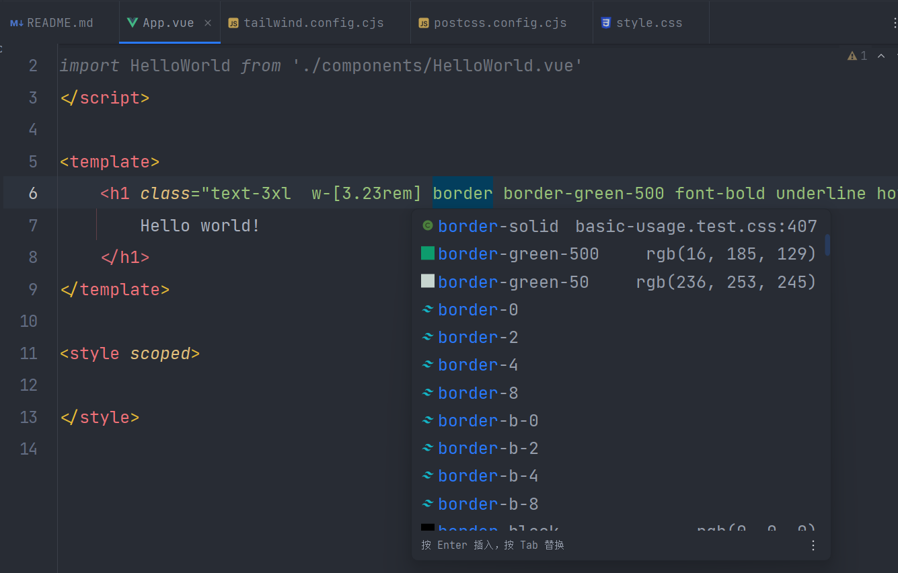

# tailwindcss的使用

### 1.使用npn安装tailwindcss

第一步安装tailwindcss
安装 Tailwind CSS 并创建 tailwind.config.js 配置文件
```bash
# 安装 tailwindcss
npm install -D tailwindcss
# 初始化会生成 tailwind.config.js 配置文件
npx tailwindcss init
```
第二步：编辑tailwindcss.config.js配置文件
添加文件到配置文件中
```js
module.exports = {
    content: [
        "./index.html",
        "./src/**/*.{vue,js,ts,jsx,tsx}",
    ],
    theme: {
        extend: {},
    },
    plugins: [],
}
```
第三步：添加Tailwindcss样式指令到css文件中
```css
@tailwind base;
@tailwind components;
@tailwind utilities;
```
:::warning
有警告的在vscode中安装PostCSS Language Support插件
:::
第四步：就可以在我们的项目中使用了
```vue
 <h1 class="text-3xl  w-[3.23rem] border border-green-500 font-bold underline hover:font-bold flex justify-center">
Hello world!
</h1>
```
:::info
如果是vscode开发需要安装Tailwind CSS IntelliSense插件更方便开发
:::

:::warning
如果是使用webstrom开发会出现报错的情况
根据官网的安装步骤，Install Tailwind CSS with Vite
安装完成后，在 Webstorm 中 Tailwind 始终无法自动补全，查看 Webstorm 的日志，提示报错
:::

:::danger
Tailwind CSS: Tailwind CSS: require() of ES Module xxx ailwind.config.js from xxxWebStormxxxplugins ailwindcssserver ailwindcss
:::

解决方案：
使用 cjs 修改生成的配置文件，并将 export default 写法改为 module.exports 写法
把 tailwind.config.js 修改为 tailwind.config.cjs
tailwind.config.cjs 的内容需要改为
```js
/** @type {import("tailwindcss").Config} */
module.exports = {
  content: [
    "./index.html",
    "./src/**/*.{js,ts,jsx,tsx}",
  ],
  theme: {
    extend: {},
  },
  plugins: [],
}
```
把 postcss.config.js 修改为 postcss.config.cjs
```js
module.exports = {
  plugins: {
    tailwindcss: {},
    autoprefixer: {},
  },
}
```
到最后就可以使用tailwindcss了
