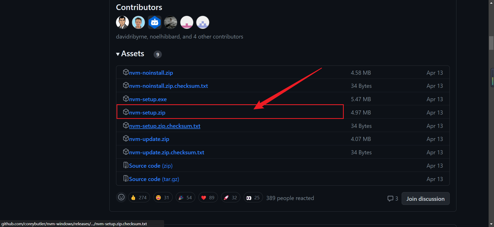
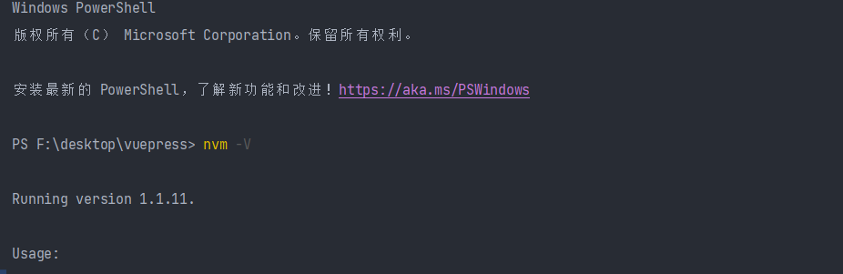
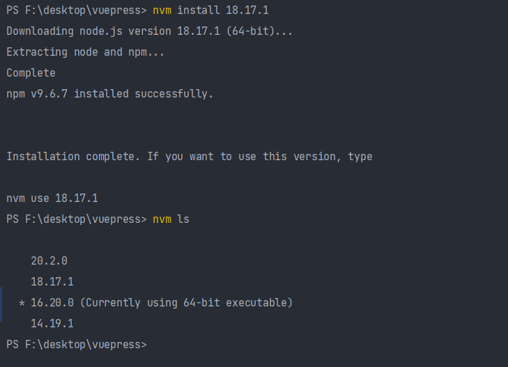

# nvm使用
# 1.nvm介绍
在工作中，我们可能同时在进行2个或者多个不同的项目开发，每个项目的需求不同，进而不同项目必须依赖不同版本的NodeJS运行环境，这种情况下，对于维护多个版本的node将会是一件非常麻烦的事情，nvm就是为解决这个问题而产生的，他可以方便的在同一台设备上进行多个node版本之间切换。
# 2.nvm下载以及使用
安装包地址[https://github.com/coreybutler/nvm-windows/releases](https://github.com/coreybutler/nvm-windows/releases)

# 3.nvm安装如果之前电脑已经安装工过node，先把node卸载再安装nvm
# 4.安装完毕之后查看nvm版本
```js
nvm -v
```

# 5.nvm常用命令
```bash
nvm install <version>       // 安装node.js的命名 version是版本号 例如：nvm install 8.12.0
nvm uninstall <version>     // 卸载node.js是的命令，卸载指定版本的nodejs，当安装失败时卸载使用
nvm ls                      // 显示所有安装的node.js版本
nvm list available          // 显示可以安装的所有node.js的版本
nvm use <version>           // 切换到使用指定的nodejs版本
nvm v                       // 显示nvm版本
```

# 6.nvm切换node版本
```bash
nvm use 20.2.0
```
