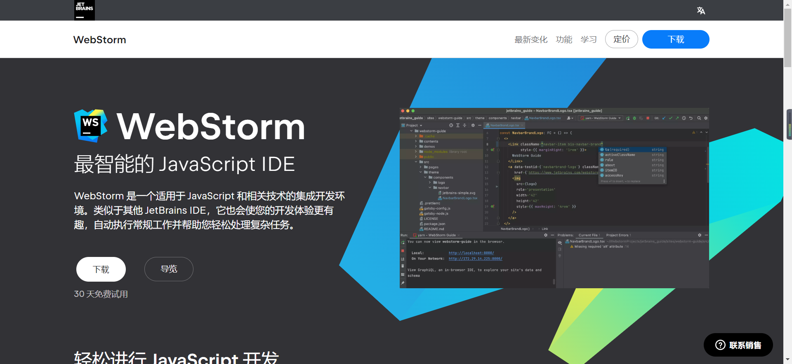
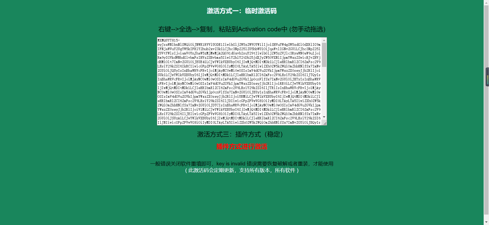
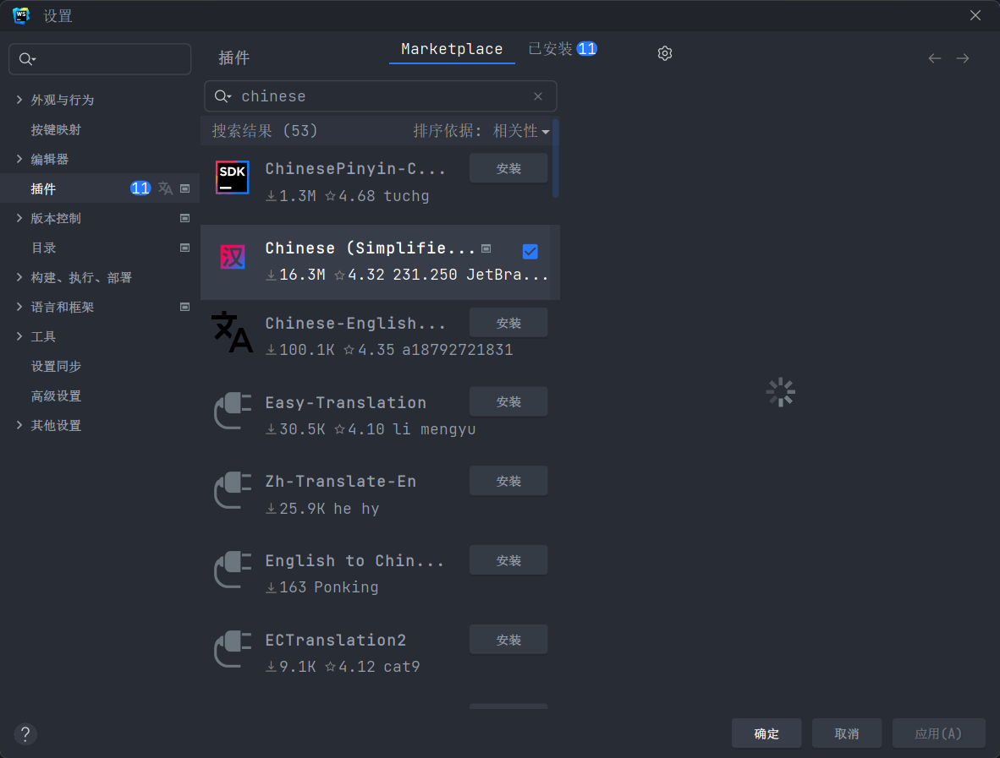
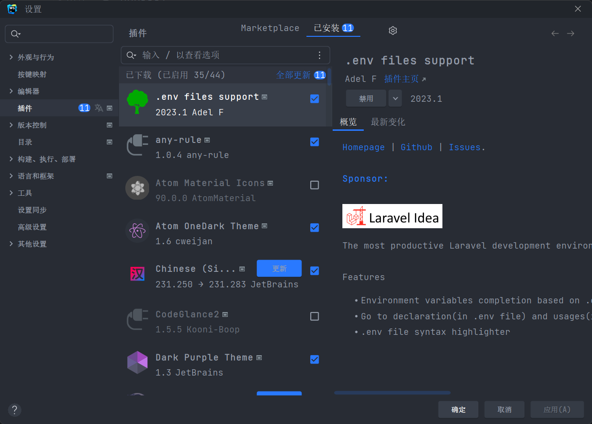
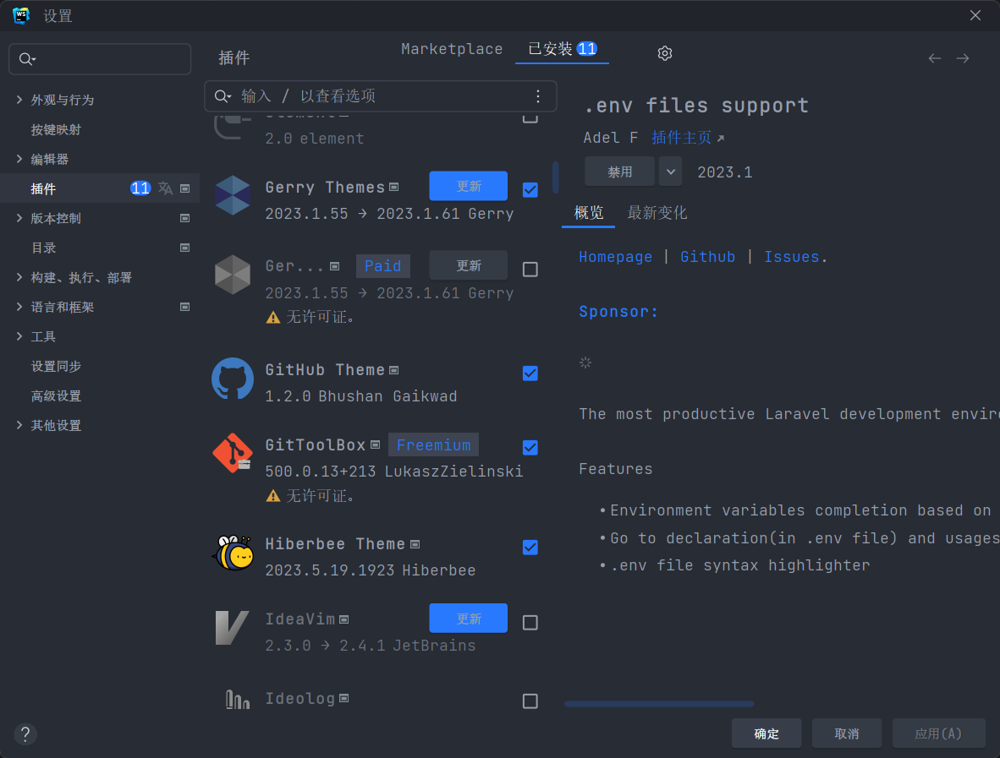
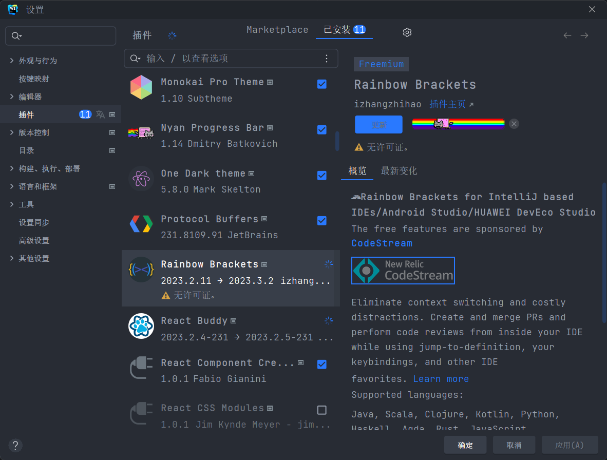

<!-- TOC -->
* [webstrom](#webstrom)
* [1.webstrom下载](#1webstrom下载)
* [2.使用激活码激活webstrom](#2使用激活码激活webstrom)
* [3.激活后第一步安装中文插件(英文好的可以不用)](#3激活后第一步安装中文插件英文好的可以不用)
* [4.安装一些常用的插件](#4安装一些常用的插件)
<!-- TOC -->
# webstrom
# 1.webstrom下载
进入到jetbrains官网下载webstrom[https://www.jetbrains.com.cn/webstorm/promo/?bd_vid=6600948847453519076](https://www.jetbrains.com.cn/webstorm/promo/?bd_vid=6600948847453519076)

# 2.使用激活码激活webstrom
激活码网站每天都更新[https://vrg123.com/](https://vrg123.com/)

# 3.激活后第一步安装中文插件(英文好的可以不用)

# 4.安装一些常用的插件
```bash
推荐一些好用的

```



